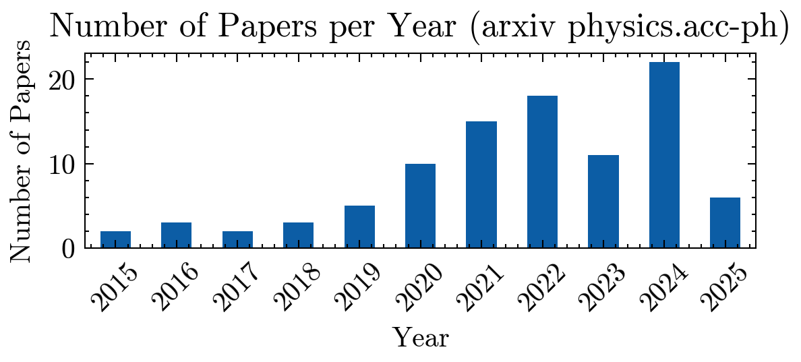

# AccML-LivingReview

In the same spirit as the [HEP Living Review](https://github.com/iml-wg/HEPML-LivingReview/), the accelerator physics community needs to accurately track the ML contributions to the field.

## Arxiv papers

Number of papers in Arxiv: 97

- [Offset Finding of Beamline Parameters on the METRIXS Beamline at BESSY II Using Machine Learning](http://arxiv.org/abs/2503.17396v1) (2025) 
- [Integration of Machine Learning-Based Plasma Acceleration Simulations into Geant4: A Case Study with the PALLAS Experiment](http://arxiv.org/abs/2503.12154v1) (2025) 
- [Optimisation of the Accelerator Control by Reinforcement Learning: A Simulation-Based Approach](http://arxiv.org/abs/2503.09665v1) (2025) 
- [Bayesian optimization of beam injection and storage in the PSI muEDM Experiment](http://arxiv.org/abs/2503.01607v1) (2025) 
- [Generative machine learning-based 6-dimensional phase space reconstruction using bunch compressors at PAL-XFEL](http://arxiv.org/abs/2502.20654v1) (2025) 
- [Explainable physics-based constraints on reinforcement learning for accelerator controls](http://arxiv.org/abs/2502.20247v2) (2025) 
- [Emittance Minimization for Aberration Correction II: Physics-informed Bayesian Optimization of an Electron Microscope](http://arxiv.org/abs/2412.20356v2) (2024) 
- [Harnessing Machine Learning for Single-Shot Measurement of Free Electron Laser Pulse Power](http://arxiv.org/abs/2411.09468v2) (2024) 
- [Microsecond-Latency Feedback at a Particle Accelerator by Online Reinforcement Learning on Hardware](http://arxiv.org/abs/2409.16177v1) (2024) 
- [Machine Learning for Reducing Noise in RF Control Signals at Industrial Accelerators](http://arxiv.org/abs/2409.03931v1) (2024) 
- [Surrogate Models studies for laser-plasma accelerator electron source design through numerical optimisation](http://arxiv.org/abs/2408.15845v1) (2024) 
- [Beamline Steering Using Deep Learning Models](http://arxiv.org/abs/2408.13657v1) (2024) 
- [Dynamic Exclusion of Low-Fidelity Data in Bayesian Optimization for Autonomous Beamline Alignment](http://arxiv.org/abs/2408.06540v1) (2024) 
- [Bayesian optimization of laser wakefield acceleration in the self-modulated regime (SM-LWFA) aiming to produce molybdenum-99 via photonuclear reactions](http://arxiv.org/abs/2407.20087v2) (2024) 
- [Linac_Gen: integrating machine learning and particle-in-cell methods for enhanced beam dynamics at Fermilab](http://arxiv.org/abs/2406.16630v1) (2024) 
- [Injection Optimization at Particle Accelerators via Reinforcement Learning: From Simulation to Real-World Application](http://arxiv.org/abs/2406.12735v2) (2024) 
- [Bayesian optimization scheme for the design of a nanofibrous high power target](http://arxiv.org/abs/2405.19490v2) (2024) 
- [Long Short-Term Memory Networks for Anomaly Detection in Magnet Power Supplies of Particle Accelerators](http://arxiv.org/abs/2405.18321v1) (2024) 
- [Automated Anomaly Detection on European XFEL Klystrons](http://arxiv.org/abs/2405.12391v1) (2024) 
- [Accelerator beam phase space tomography using machine learning to account for variations in beamline components](http://arxiv.org/abs/2405.10028v1) (2024) 
- [Accelerating Cavity Fault Prediction Using Deep Learning at Jefferson Laboratory](http://arxiv.org/abs/2404.15829v1) (2024) 
- [Efficient 6-dimensional phase space reconstruction from experimental measurements using generative machine learning](http://arxiv.org/abs/2404.10853v2) (2024) 
- [Multi-Objective Bayesian Active Learning for MeV-ultrafast electron diffraction](http://arxiv.org/abs/2404.02268v2) (2024) 
- [Leveraging Prior Mean Models for Faster Bayesian Optimization of Particle Accelerators](http://arxiv.org/abs/2403.03225v4) (2024) 
- [Optimizing Dynamic Aperture Studies with Active Learning](http://arxiv.org/abs/2402.11077v1) (2024) 
- [Anomaly Detection of Particle Orbit in Accelerator using LSTM Deep Learning Technology](http://arxiv.org/abs/2401.15543v1) (2024) 
- [Machine-learning approach for operating electron beam at KEK $e^-/e^+$ injector Linac](http://arxiv.org/abs/2401.14739v1) (2024) 
- [Cheetah: Bridging the Gap Between Machine Learning and Particle Accelerator Physics with High-Speed, Differentiable Simulations](http://arxiv.org/abs/2401.05815v1) (2024) 
- [Bayesian Optimization Algorithms for Accelerator Physics](http://arxiv.org/abs/2312.05667v2) (2023) 
- [Efficient prediction of attosecond two-colour pulses from an X-ray free-electron laser with machine learning](http://arxiv.org/abs/2311.14751v3) (2023) 
- [Machine Learning For Beamline Steering](http://arxiv.org/abs/2311.07519v1) (2023) 
- [Uncertainty Aware Deep Learning for Particle Accelerators](http://arxiv.org/abs/2309.14502v1) (2023) 
- [Resilient VAE: Unsupervised Anomaly Detection at the SLAC Linac Coherent Light Source](http://arxiv.org/abs/2309.02333v1) (2023) 
- [Machine Learning Based Alignment For LCLS-II-HE Optics](http://arxiv.org/abs/2308.07521v1) (2023) 
- [Time-drift Aware RF Optimization with Machine Learning Techniques](http://arxiv.org/abs/2307.04544v1) (2023) 
- [Distance Preserving Machine Learning for Uncertainty Aware Accelerator Capacitance Predictions](http://arxiv.org/abs/2307.02367v1) (2023) 
- [Learning to Do or Learning While Doing: Reinforcement Learning and Bayesian Optimisation for Online Continuous Tuning](http://arxiv.org/abs/2306.03739v1) (2023) 
- [Detecting resonance of radio-frequency cavities using fast direct integral equation solvers and augmented Bayesian optimization](http://arxiv.org/abs/2305.05918v2) (2023) 
- [Optimization of the injection beam line at the Cooler Synchrotron COSY using Bayesian Optimization](http://arxiv.org/abs/2302.09133v2) (2023) 
- [Bayesian optimization of laser-plasma accelerators assisted by reduced physical models](http://arxiv.org/abs/2212.12551v1) (2022) 
- [A machine-learning based closed orbit feedback for the SSRF storage ring](http://arxiv.org/abs/2212.01010v1) (2022) 
- [Data-driven Science and Machine Learning Methods in Laser-Plasma Physics](http://arxiv.org/abs/2212.00026v2) (2022) 
- [Bayesian Optimization of the Beam Injection Process into a Storage Ring](http://arxiv.org/abs/2211.09504v2) (2022) 
- [Prior-mean-assisted Bayesian optimization application on FRIB Front-End tunning](http://arxiv.org/abs/2211.06400v1) (2022) 
- [Neural Networks as Effective Surrogate Models of Radio-Frequency Quadrupole Particle Accelerator Simulations](http://arxiv.org/abs/2210.11451v2) (2022) 
- [Multi-objective and multi-fidelity Bayesian optimization of laser-plasma acceleration](http://arxiv.org/abs/2210.03484v2) (2022) 
- [Machine learning-based analysis of experimental electron beams and gamma energy distributions](http://arxiv.org/abs/2209.12119v2) (2022) 
- [Uncertainty Aware ML-based surrogate models for particle accelerators: A Study at the Fermilab Booster Accelerator Complex](http://arxiv.org/abs/2209.07458v3) (2022) 
- [Automatic setup of 18 MeV electron beamline using machine learning](http://arxiv.org/abs/2209.03183v1) (2022) 
- [Diagnostics for Linac Optimization With Machine Learning](http://arxiv.org/abs/2209.02526v1) (2022) 
- [Transverse phase space tomography in the CLARA accelerator test facility using image compression and machine learning](http://arxiv.org/abs/2209.00814v1) (2022) 
- [Tuning Particle Accelerators with Safety Constraints using Bayesian Optimization](http://arxiv.org/abs/2203.13968v3) (2022) 
- [Optimizing a Superconducting Radiofrequency Gun Using Deep Reinforcement Learning](http://arxiv.org/abs/2203.09935v1) (2022) 
- [Adaptive Machine Learning for Time-Varying Systems: Towards 6D Phase Space Diagnostics of Short Intense Charged Particle Beams](http://arxiv.org/abs/2203.04391v2) (2022) 
- [SUPA: A Lightweight Diagnostic Simulator for Machine Learning in Particle Physics](http://arxiv.org/abs/2202.05012v2) (2022) 
- [Explainable Machine Learning for Breakdown Prediction in High Gradient RF Cavities](http://arxiv.org/abs/2202.05610v2) (2022) 
- [Anomaly Detection at the European XFEL using a Parity Space based Method](http://arxiv.org/abs/2202.02051v1) (2022) 
- [Anomaly Detection in Particle Accelerators using Autoencoders](http://arxiv.org/abs/2112.07793v1) (2021) 
- [Input Beam Matching and Beam Dynamics Design Optimization of the IsoDAR RFQ using Statistical and Machine Learning Techniques](http://arxiv.org/abs/2112.02579v1) (2021) 
- [Online-compatible Unsupervised Non-resonant Anomaly Detection](http://arxiv.org/abs/2111.06417v1) (2021) 
- [Uncertainty aware anomaly detection to predict errant beam pulses in the SNS accelerator](http://arxiv.org/abs/2110.12006v1) (2021) 
- [Quantifying Uncertainty for Machine Learning Based Diagnostic](http://arxiv.org/abs/2107.14261v1) (2021) 
- [Beam Measurements and Machine Learning at the CERN Large Hadron Collider](http://arxiv.org/abs/2107.12641v1) (2021) 
- [Adaptive Machine Learning for Time-Varying Systems: Low Dimensional Latent Space Tuning](http://arxiv.org/abs/2107.06207v1) (2021) 
- [Machine learning enabled fast evaluation of dynamic aperture for storage ring accelerators](http://arxiv.org/abs/2107.05623v2) (2021) 
- [Turn-Key Constrained Parameter Space Exploration for Particle Accelerators Using Bayesian Active Learning](http://arxiv.org/abs/2106.09202v1) (2021) 
- [Invertible Surrogate Models: Joint surrogate modelling and reconstruction of Laser-Wakefield Acceleration by invertible neural networks](http://arxiv.org/abs/2106.00432v1) (2021) 
- [Developing Robust Digital Twins and Reinforcement Learning for Accelerator Control Systems at the Fermilab Booster](http://arxiv.org/abs/2105.12847v1) (2021) 
- [SPIRAL2 Cryomodules Models: a Gateway to Process Control and Machine Learning](http://arxiv.org/abs/2103.10299v1) (2021) 
- [Improving Surrogate Model Accuracy for the LCLS-II Injector Frontend Using Convolutional Neural Networks and Transfer Learning](http://arxiv.org/abs/2103.07540v2) (2021) 
- [Machine learning-based direct solver for one-to-many problems on temporal shaping of relativistic electron beams](http://arxiv.org/abs/2103.06594v3) (2021) 
- [Adaptive deep learning for time-varying systems with hidden parameters: Predicting changing input beam distributions of compact particle accelerators](http://arxiv.org/abs/2102.10510v2) (2021) 
- [Model-free and Bayesian Ensembling Model-based Deep Reinforcement Learning for Particle Accelerator Control Demonstrated on the FERMI FEL](http://arxiv.org/abs/2012.09737v2) (2020) 
- [Beyond optimization -- supervised learning applications in relativistic laser-plasma experiments](http://arxiv.org/abs/2011.05866v5) (2020) 
- [Machine learning assisted non-destructive transverse beam profile imaging](http://arxiv.org/abs/2010.15243v2) (2020) 
- [Multi-Objective Bayesian Optimization for Accelerator Tuning](http://arxiv.org/abs/2010.09824v2) (2020) 
- [Autonomous Control of a Particle Accelerator using Deep Reinforcement Learning](http://arxiv.org/abs/2010.08141v2) (2020) 
- [Machine learning for beam dynamics studies at the CERN Large Hadron Collider](http://arxiv.org/abs/2009.08109v1) (2020) 
- [Surrogate Modeling of the CLIC Final-Focus System using Artificial Neural Networks](http://arxiv.org/abs/2009.06454v2) (2020) 
- [Multiobjective optimization of the dynamic aperture for SLS 2.0 using surrogate models based on artificial neural networks](http://arxiv.org/abs/2008.04151v1) (2020) 
- [Introduction to Machine Learning for Accelerator Physics](http://arxiv.org/abs/2006.09913v1) (2020) 
- [Superconducting radio-frequency cavity fault classification using machine learning at Jefferson Laboratory](http://arxiv.org/abs/2006.06562v1) (2020) 
- [Machine learning for design optimization of storage ring nonlinear dynamics](http://arxiv.org/abs/1910.14220v1) (2019) 
- [Studies in Applying Machine Learning to LLRF and Resonance Control in Superconducting RF Cavities](http://arxiv.org/abs/1910.07648v2) (2019) 
- [Bayesian optimization of a free-electron laser](http://arxiv.org/abs/1909.05963v1) (2019) 
- [RF design of APEX2 two-cell continuous-wave normal conducting photoelectron gun cavity based on multi-objective genetic algorithm](http://arxiv.org/abs/1905.10619v2) (2019) 
- [Machine Learning for Orders of Magnitude Speedup in Multi-Objective Optimization of Particle Accelerator Systems](http://arxiv.org/abs/1903.07759v5) (2019) 
- [Opportunities in Machine Learning for Particle Accelerators](http://arxiv.org/abs/1811.03172v1) (2018) 
- [Multi-objective shape optimization of radio frequency cavities using an evolutionary algorithm](http://arxiv.org/abs/1810.02990v3) (2018) 
- [Online storage ring optimization using dimension-reduction and genetic algorithms](http://arxiv.org/abs/1807.10720v3) (2018) 
- [Machine learning for analysis of plasma driven Ion source](http://arxiv.org/abs/1709.02109v2) (2017) 
- [Recurrent Neural Networks for anomaly detection in the Post-Mortem time series of LHC superconducting magnets](http://arxiv.org/abs/1702.00833v1) (2017) 
- [Machine learning applied to single-shot x-ray diagnostics in an XFEL](http://arxiv.org/abs/1610.03378v1) (2016) 
- [Optimizing the lattice design for a diffraction-limited storage ring with a rational combination of particle swarm and genetic algorithms](http://arxiv.org/abs/1605.05021v1) (2016) 
- [A Genetic Algorithm for Chromaticity Correction in Diffraction Limited Storage Rings](http://arxiv.org/abs/1603.02459v2) (2016) 
- [Initial experimental results of a machine learning-based temperature control system for an RF gun](http://arxiv.org/abs/1511.01883v1) (2015) 
- [Improving the nonlinear performance of the HEPS baseline design with genetic algorithm](http://arxiv.org/abs/1509.09275v1) (2015) 
